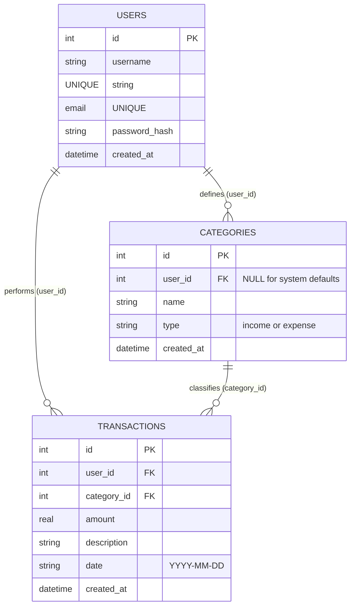

# Personal Finance Tracker

A lightweight, modern, and highly secure **Personal Finance Tracker** built for Web Programming II. This application provides a complete solution for users to register, log in, manage custom transaction categories, and track income and expenses in real-time.

Built using **Node.js, Express, SQLite, and Vanilla HTML/CSS/JS (with Fetch API)**, the project follows strict MVC architecture rules and incorporates robust defense-in-presentation mechanisms.

---

## 🌟 Key Features

1. **User Authentication & Session Management**:
   * Secure user registration and login with password hashing powered by `bcryptjs`.
   * Stateless authentication utilizing JSON Web Tokens (JWT) stored client-side in the browser's `localStorage`.
   * Secure automatic login redirection upon successful registration.
2. **Defensive Category CRUD**:
   * Supports custom category creation (Income/Expense).
   * Populates 8 system default categories on startup (e.g. Salary, Rent, Food) that are shared across all users.
   * **Security Policy**: Enforces read-only permissions on default system categories (users cannot rename or delete system defaults).
3. **User-Isolated Transaction CRUD**:
   * Complete logging of transactions (date, amount, category, description).
   * Double-checks database actions ensuring that users can only fetch, modify, or delete their own transactions.
4. **Interactive Dashboard**:
   * Dynamic summary cards displaying Net Balance, Total Income, and Total Expenses.
   * Category breakdowns representing spending weight ratios via custom progress bars.
   * Real-time UI updates on transaction additions/deletions.

---

## 📊 Relational Database Schema (ERD)

The application utilizes **SQLite** as its relational database. Below is the Entity-Relationship Diagram representing the schema structure:



---

## 📂 MVC Directory Structure

The codebase is organized according to the **Model-View-Controller (MVC)** architectural design pattern:

```text
web-2/
├── config/
│   └── db.js                 # SQLite connection & default category seeding
├── middleware/
│   ├── auth.js               # JWT verification middleware
│   └── logger.js             # API request logger & global error handlers
├── controllers/
│   ├── authController.js     # Signup and signin endpoint handlers
│   ├── categoryController.js # Category CRUD checks
│   └── txnController.js      # Transaction CRUD and isolation checks
├── models/
│   ├── User.js               # User DB access queries
│   ├── Category.js           # Category DB access queries
│   └── Transaction.js        # Transaction DB access queries
├── routes/
│   ├── authRoutes.js         # /api/auth API paths
│   ├── categoryRoutes.js     # /api/categories API paths
│   └── txnRoutes.js          # /api/transactions API paths
├── public/                   # Static Frontend files
│   ├── css/
│   │   └── style.css         # Responsive glassmorphism styling sheet
│   ├── js/
│   │   ├── auth.js           # Login & Registration fetch client
│   │   └── dashboard.js      # Dashboard stats, listings, & event listener logic
│   ├── login.html            # Authentication GUI (Login/Register tab cards)
│   └── index.html            # Core metrics & CRUD dashboard GUI
├── logs/
│   └── app.log               # Server execution error and request log files
├── .env                      # Local server configuration parameters
├── server.js                 # Core application entry point
├── schema.sql                # Relational Database tables DDL schema
└── package.json              # App details and node module dependencies
```

---

## ⚙️ Installation & Configuration

Follow these steps to set up and run the application locally:

### 1. Prerequisite
Ensure you have **Node.js** (v18+) installed on your machine.

### 2. Install Dependencies
Clone or extract the repository, navigate into the project root directory, and install dependencies:
```bash
npm install
```

### 3. Setup Environment Parameters
Create a file named `.env` in the root workspace folder and configure your parameters:
```env
PORT=3000
JWT_SECRET=finance_tracker_jwt_secret_token_key_2026
```

### 4. Run the Server
Launch the application:
```bash
npm start
```
On startup:
* The database script automatically compiles `schema.sql` to initialize tables.
* A file named `database.sqlite` is generated in the root directory.
* Default system categories are seeded into the database if not already present.

### 5. Access the Web App
Open your browser and navigate to:
```text
http://localhost:3000/login.html
```

---

## 🛡️ Presentation Defensive Points

Be prepared to explain the following security and design defense mechanisms to your evaluators:

1. **User Isolation on Mutations**:
   * When a user updates or deletes a transaction, the SQL statement relies on both the transaction ID and user ID:
     `UPDATE transactions SET ... WHERE id = ? AND user_id = ?`
   * Even if someone manipulates a request to edit another user's transaction ID, the database operation returns `0 rows affected`, and the controller safely blocks it with a `403 Forbidden` response.
2. **Read-Only System Defaults**:
   * Standard categories (Rent, Food, Salary) have a `user_id` value of `NULL`.
   * Category creation sets `user_id` to the active user's ID.
   * Modifying or deleting categories enforces that the target record's `user_id` matches the token user ID, naturally preventing users from tampering with standard system defaults.
3. **Database Joins**:
   * Instead of making multiple database queries to render the transactions table, `Transaction.findAllByUserId` makes a relational `JOIN`:
     ```sql
     SELECT t.*, c.name AS category_name, c.type AS category_type 
     FROM transactions t 
     JOIN categories c ON t.category_id = c.id
     WHERE t.user_id = ?
     ```
   * This showcases database optimization and relational capabilities, which is a key grading metric for relational database projects.
